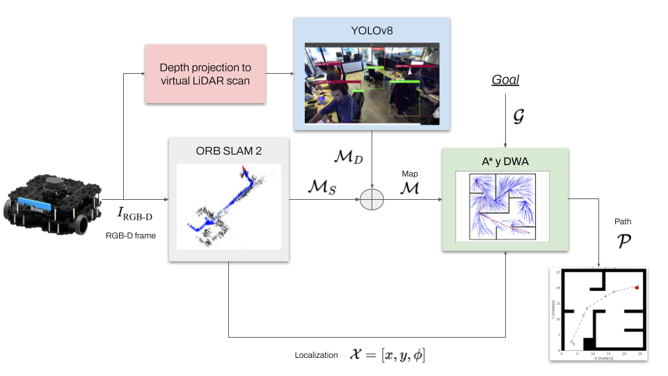

# Unified autonomous navigation framework

The repository implements a unified autonomous navigation framework for Turtlebot3 robot which includes perception, SLAM, and planning fully integrated. This was part of the final project of the course Autonomous Robotics (MT-0013) at UTEC@Peru. It is capable of handling dynamic env due to its two-step map generation from ORB-SLAM 2 and YOLOv8 which contributes to the dynamic local map only composed of people to meant to be avoided.
Also, it includes two planers: RRT (global planner) and DWA (local planer) where the last one handles the dynamic obstacles.

# Overview of components



# Dependencies
* Octomap
* ros-navigation
* Ultralytics
* Depthimage_to_laserscan
* Turtlebot3, simulations, and messages 

# Steps for execution

1. Launch your selected Gazebo env and ORB-SLAM 2 for static mapping. Consider modifying the second launch according to your camera parameters.
  
    ```bash
    roslaunch your_gazebo_worlds_package your_gazebo_env.launch
    roslaunch orb_slam2_ros orb_slam2_rgbd_mapping.launch
    rosrun turtlebo3_teleop keyboard_teleop
    ```

2. Once your env has been fully explored, generate its occupancy grid and save both the grid file (.pgm) and ORB-SLAM 2 map (.bin).

    ```bash
    roslaunch orb_slam2_ros pointcloud_octomap.launch
    rosrun orb_slam2_ros filter_raw_map.py
    rosrun map_server map_saver --occ 90 --free 10 -f mymap map:=/filtered_raw
    rosservice call /orb_slam2_rgbd/save_map map.bin 
    ```

3. Load both maps, execute the planners, initiate YOLOv8 detection, and generate a virtual LiDAR scan from the depth image
   
    ```bash
    roslaunch orb_slam2_ros orb-slam2_rgbd_localization.launch
    rosrun orb_slam2_ros sendOdom2Map.py
    rosrun orb_slam2_ros filter_depth_people.py
    cd ros_motion_planning/src/sim_env/scripts/
    chmod u+x ./main.sh
    ./main.sh
    ```
# Contact

  *marcelo.contreras@utec.edu.pe
  *cesar.guillen@utec.edu.pe
  *mauricio.rivera@utec.edu.pe
  *edward.lopez.t@utec.edu.pe
